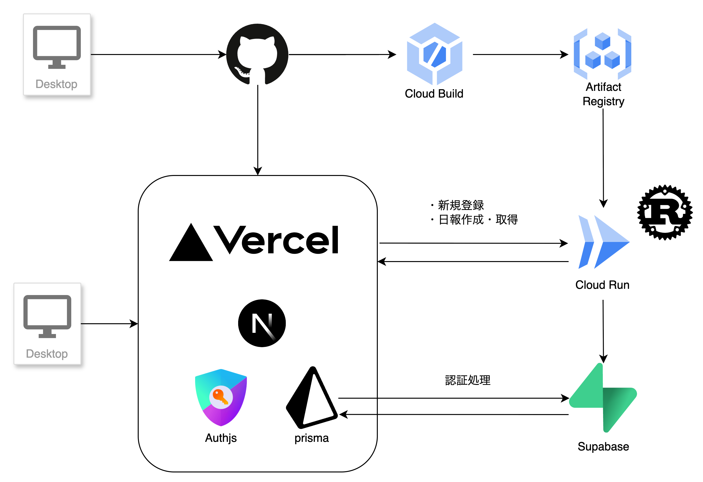
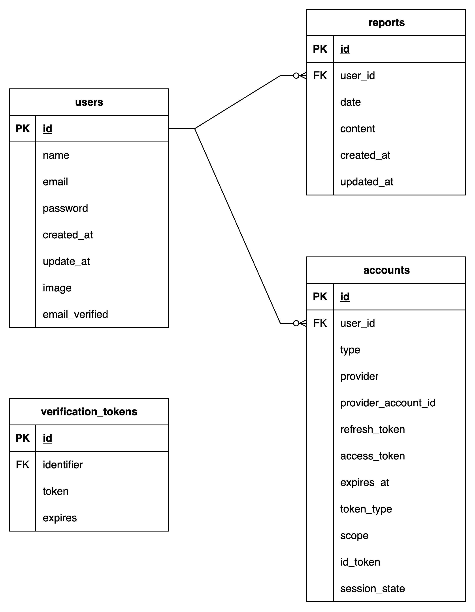

# 仕様
日報を管理するツール。

## 機能一覧
- 日報一覧表示
  * 年を切り替えることでその年に作成した各月ごとに日報が階層で管理できる
  * 左サイドバーに月一覧が表示され、クリックするとその月をexpandが開き、月内の日報が月下の階層で表示される
- 日報詳細表示
  * 選択した日報は、URL上で:idで指定して表示される
  * 選択(クリック)した日報は右側のコンテンツエリアに本文が表示される
- 日報を新規作成、編集、削除できる
  * 新規作成
    * 新規作成専用画面で作成用フォームで年月日を入力して作成する
  * 編集
    * 選択(クリック)した日報は右側のコンテンツエリアで直接編集することができる
  * 削除
    * 日報詳細を表示して、その日報のコンテンツエリア内に表示される削除ボタンで削除できる
- 認証機能(新規登録、ログイン、ログアウト)
  * メールベース認証
  * OAuth認証

## アーキテクチャ

## DB設計

## 技術スタック
- パッケージ管理ツール: pnpm
- フロント
  * Nextjs
  * TypeScript
  * Shadcn
  * Tailwind
  * prisma
  * Authjs
- バックエンド
  * Rust
  * Axum
- インフラ
  * GCP (Cloud Build/Artifact Registry/CloudRun)
  * Supabase
  * Vercel